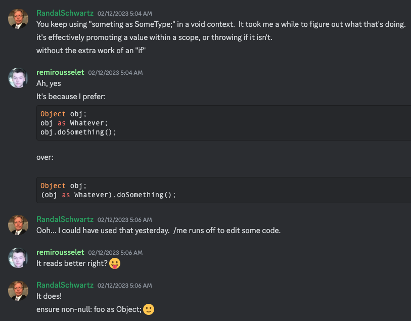
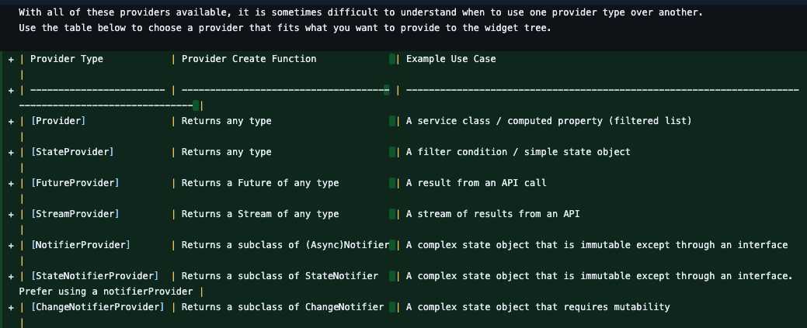

# Tips and Tricks

## Generated files nesting

The below snippet allows you to nest auto-generated files underneath their parent/source file e.g.


```js
{
    "explorer.fileNesting.enabled": true,
    "explorer.fileNesting.expand": false,
    "explorer.fileNesting.patterns": {
        "pubspec.yaml": "pubspec.lock,pubspec_overrides.yaml,.packages,.flutter-plugins,.flutter-plugins-dependencies,.metadata",
        "*.dart": "${capture}.g.dart,${capture}.freezed.dart",

    }
}
```

## Snippets

Add these snippets to your user snippets json. I created a new snippets file simply called 'flutter_snippets'.

### Base Flutter main.dart snipper

This is just a small, custom snippet I made to create a very basic `main.dart` for when you create a new Flutter app.

```js
"Homepage Dart Snippet": {
	"scope": "dart",
	"body": [
"import 'package:flutter/material.dart';",
"",
"void main() {",
"  runApp(const MyApp());",
"}",
"",
"class MyApp extends StatelessWidget {",
"  const MyApp({super.key});",
"",
"  @override",
"  Widget build(BuildContext context) {",
"    return MaterialApp(",
"      title: 'Flutter Demo',",
"      theme: ThemeData(",
"        colorScheme: ColorScheme.fromSeed(seedColor: Colors.deepPurple),",
"        useMaterial3: true,",
"      ),",
"      home: const MyHomePage(),",
"    );",
"  }",
"}",
"",
"class MyHomePage extends StatelessWidget {",
"  const MyHomePage({super.key});",
"",
"  @override",
"  Widget build(BuildContext context) {",
"    return Scaffold(",
"      appBar: AppBar(title: const Text('Homepage')),",
"    );",
"  }",
"}",

		],
		"prefix": "fluthome"
```

### Parts statements

These are the statements you need at the top of your document to inform your code-gen libraries that this is a relevant file (Freezed, Riverpod, JSON etc).

```js
"Part statement": {
    "prefix": "pts",
    "body": [
      "part '${TM_FILENAME_BASE}.g.dart';",
    ],
    "description": "Creates a filled-in part statement"
  },
  "Part 'Freezed' statement": {
    "prefix": "ptf",
    "body": [
      "part '${TM_FILENAME_BASE}.freezed.dart';",
    ],
    "description": "Creates a filled-in freezed part statement"
  },
```

### Freezed snippets

These are useful as Freezed does not come with these out the box! I found the Riverpod snippets that come along with the libraries for Riverpod super useful - so wanted some Freezed ones too.

```js
"Freezed Data Class": {
    "prefix": "fdataclass",
    "body": [
      "@freezed",
      "abstract class ${1:DataClass} with _$${1:DataClass}{",
      "  const factory ${1:DataClass}(${2}) = _${1:DataClass};",
      "}"
    ],
    "description": "Freezed Data Class"
  },
  "Freezed Union": {
    "prefix": "funion",
    "body": [
      "@freezed",
      "abstract class ${1:Union} with _$${1:Union}{",
      "  const factory ${1:Union}.${2}(${4}) = ${3};",
      "}"
    ],
    "description": "Freezed Union"
  },
  "Freezed Union Case": {
    "prefix": "funioncase",
    "body": [
      "const factory ${1:Union}.${2}(${4}) = ${3};"
    ],
    "description": "Freezed Union Case"
  },
  "From JSON": {
    "prefix": "fromJson",
    "body": [
      "factory ${1}.fromJson(Map<String, dynamic> json) => _$${1}FromJson(json);"
    ],
    "description": "From JSON"
  },
```

## Code Examples / Recipes

These are just very small code examples I found that in most instances I am yet to use but wanted to have them on hand in case I did need something like it! Mainly taken from Discord and repos.

### StreamProvider

```js
Future<Value> build() async {
  await for (final value in stream) {
    state = AsyncData(value);
  }
  return future;
}
```

### Handle components that may send an error/loading state

```js
return anyAsyncData.maybeWhen(
  data: ..
  orElse: () => LoadingWidget(),
);
```

## Scripts

### Poll for changes in repos

```js
#!/bin/zsh
for i in */.git; do (
    echo "====== $i:h ======"
    cd $i:h &&
        git pull
); done

for i in */.git; do
    (
        cd $i:h &&
            git log -1 --all --date=iso-local --format='%ad' |
            read x
        echo "$x $i:h"
    )
done | sort -r
```

And here's a good list to start:

```

dart-petitparser
dart-petitparser-examples
deliverzler
flutter
flutter-packages
flutter_animate
flutter_hooks
fpdart
functional_widget
google_maps
language
provider
river_pod
sdk
```

_Appreciation_: This came from [Randal Schwartz](https://github.com/RandalSchwartz) (who you will see a lot from below) who posted it publically in the Riverpod Discord.

## Words of Wisdom

### Future Provider or AsyncNotifier?


### obj as Whatever



### To Stream or not to Stream?


### Want a streamProvider?


### ref vs provider


### When to use what provider?


